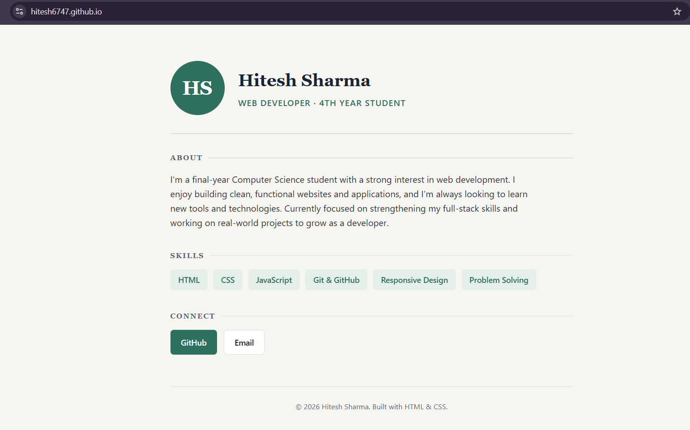

# 🧑‍💻 About Me – Personal Portfolio Page

This is my **first web development project** — a simple, professional "About Me" page built using **HTML & CSS**. It introduces who I am, my skills, and links to my GitHub so people can check out my work.

## 🔗 Live Demo
👉 [View Live Site](https://hitesh6747.github.io) 

## 📸 Screenshot

## ✨ Features
- Clean, resume-style design
- Skills section
- GitHub & Email contact links
- Fully responsive (works on mobile)

## 🛠️ Built With
- HTML5
- CSS3

## 🚀 How to Run Locally
1. Download or clone this repository
2. Open `index.html` in any web browser
3. That's it — no installation needed!

## 📬 Contact
- GitHub: [@Hitesh6747](https://github.com/Hitesh6747)
- Email: hiteshsharma8320@gmail.com

---
⭐ This is Project #1 in my web development journey — more coming soon!
